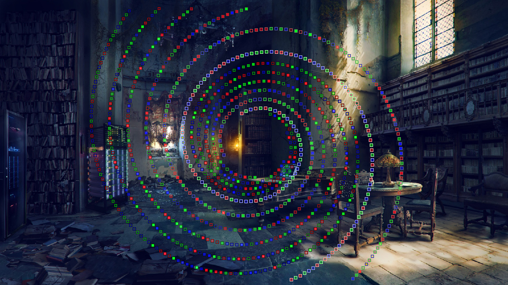

# Python puzzles
A collection of programmer puzzles, written in Python

## Text bock
The image contains multiple levels of puzzle.

## Swirl of squares
Figure out how to organise the spirals into a message.

