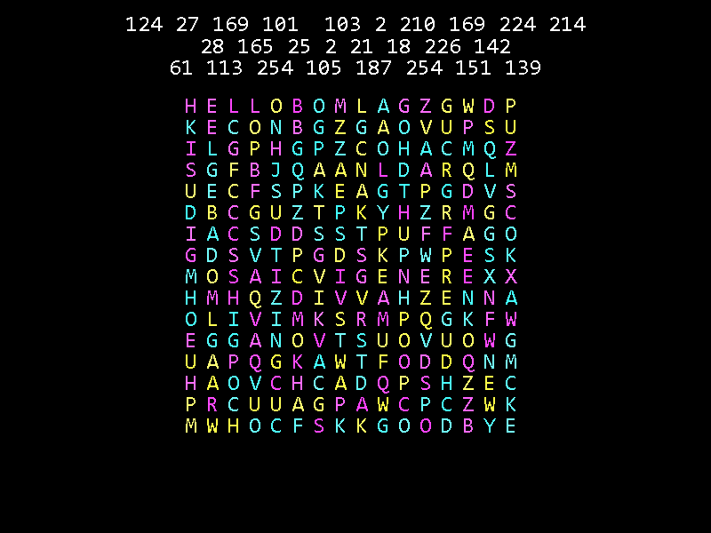

# Python puzzles
A collection of programmer puzzles, written in Python.

Old, dirty code written to get the job done. Puzzles look cool at least.

## Text block
The image contains multiple levels of puzzle.

## Swirl of squares
Figure out how to organise the spirals into a message.

## Word search
Figure out the meaning of the word search block.

